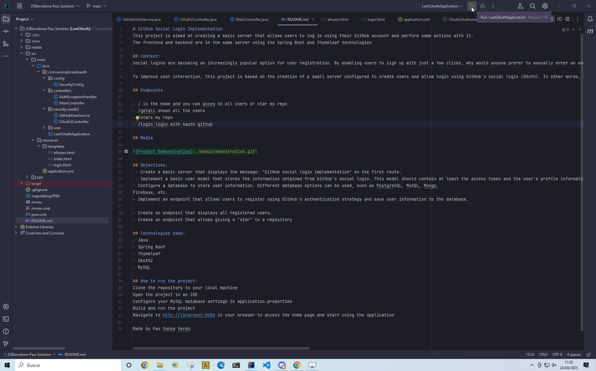

# GitHub Social Login Implementation
This project is aimed at creating a basic server that allows users to log in using their GitHub account and perform some actions with it.
The frontend and backend are in the same server using the Spring Boot and Thymeleaf technologies

## Context:
Social logins are becoming an increasingly popular option for user registration. By enabling users to sign up with just a few clicks, why would anyone prefer to manually enter an email and password and then have to confirm it, especially when using a mobile device? Social logins provide a much more convenient user experience, and that's why it's important to know how to implement them and navigate the documentation proposed by different companies.

To improve user interaction, this project is based on the creation of a small server configured to create users and allow login using GitHub's social login (OAuth). In other words, a server will be created that will allow users to log in by authorizing their GitHub account and perform some actions with it.

## Media

## Objectives:
 - Create a basic server that displays the message: "GitHub social login implementation" on the first route.
 - Implement a basic user model that stores the information obtained from GitHub's social login. This model should contain at least the access token and the user's profile information.
- Configure a database to store user information. Different database options can be used, such as PostgreSQL, MySQL, Mongo,
Firebase, etc. 
- Implement an endpoint that allows users to register using GitHub's authentication strategy and save user information to the database.

- Create an endpoint that displays all registered users.
- ~~Create an endpoint that allows giving a "star" to a repository.~~ Not implemented due to time constraints (I had only one day to make the challenge) 

## Technologies Used:
- Java
- Spring Boot
- Thymeleaf
- OAuth2
- MySQL

## How to run the project:
Clone the repository to your local machine
Open the project in an IDE
Configure your MySQL database settings in application.properties
Build and run the project
Navigate to http://localhost:8080 in your browser to access the home page and start using the application

Made by Pau Sansa Verdu